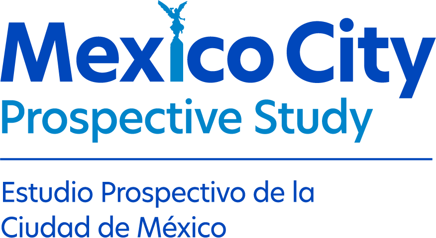

# MCPS Training Kit

Training and practical resources for researchers, collaborators, and workshop participants using the Mexico City Prospective Study.

## Training modules

The MCPS Training & Resources site provides modular training materials that can be used for **self-paced learning or as part of an organised workshop**.

### Getting Started with R and JupyterLab on DNAnexus

A beginner-friendly introduction to the standard workflow for R-based analysis on MCPS DNAnexus.

If you are unfamiliar with DNAnexus or JupyterLab, we recommend completing this module before moving on to other training modules.

[Explore Getting Started →](modules/dnanexus-onboarding/index.qmd){.btn .btn-primary}

### Survival Analysis

Practical training in survival analysis using R and MCPS-like data on DNAnexus.

*Coming soon.*

## Data safety

All users of MCPS data should be familiar with the principles for working safely with research data on DNAnexus.

[Read the Data Safety guidance →](modules/dnanexus-onboarding/participant-guide/09-data-safety-and-downloading.qmd){.btn .btn-outline-primary}