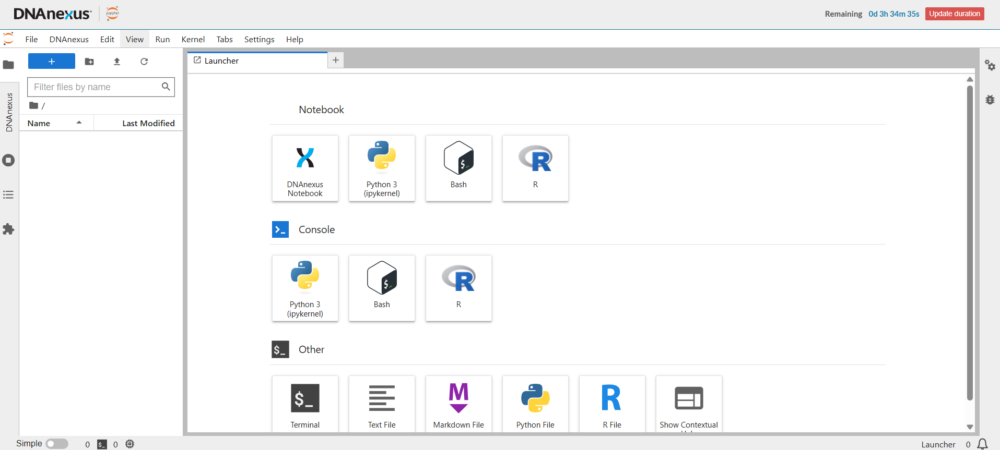
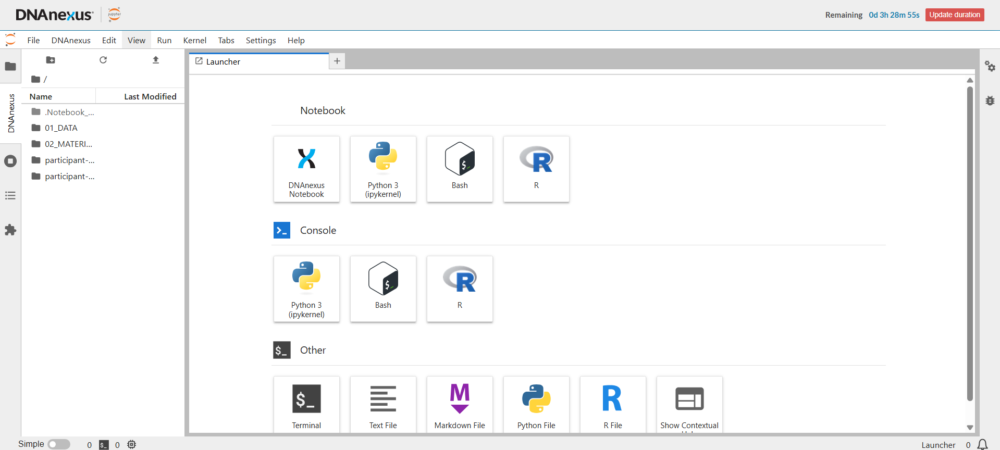

JupyterLab is now running.

Before opening your notebook, take a moment to understand the JupyterLab window. 

## 1. Meet the JupyterLab window

When JupyterLab first opens, you will see the **Launcher**.

The Launcher provides several ways to start notebooks, consoles and other tools. You do not need most of these options for this tutorial.

{fig-alt="JupyterLab Launcher showing the standard file browser on the left and notebook options in the centre"}

::: {.callout-warning title="Do not click the R notebook tile"}
The Launcher shows several notebook options, including **Python 3**, **Bash**, and **R**.

These create notebooks in the **temporary JupyterLab environment**. They are not the persistent DNAnexus Notebooks used in this tutorial.

Even though you will be working in R, **do not click the R tile**.

Instead, you will open the supplied `getting-started.ipynb` notebook from your workspace using the **DNAnexus project browser**.
:::

### The file browsers

On the left-hand side of the screen are **two different ways to browse files**, and it is important to know the difference.

::: {.callout-important title="Know which file browser you are using"}
JupyterLab gives you access to files in two different places:

**Folder icon → temporary JupyterLab files**

**DNAnexus tab → persistent files in the DNAnexus project**

In this tutorial, you will use the **DNAnexus project browser** to find your workspace and open your supplied notebook.
:::

#### The JupyterLab file browser

The **folder icon** on the left opens the standard JupyterLab file browser.

This shows files in the **temporary JupyterLab computing environment**.

::: {.callout-caution title="Temporary files"}
Files in this area belong to the temporary JupyterLab environment and should **not** be relied on as persistent storage.

For this tutorial, keep anything you need to preserve in the DNAnexus project.
:::

#### The DNAnexus project browser

Select the vertical **DNAnexus** tab on the left.

This opens the files and folders stored in your **DNAnexus project**.

{fig-alt="JupyterLab Launcher with the DNAnexus project browser open on the left, showing project folders"}

::: {.callout-important title="Know which file browser you are using"}
There are two file browsers on the left side of JupyterLab:

**Folder icon → temporary JupyterLab files**

**DNAnexus tab → persistent project files**

For this tutorial, use the **DNAnexus project browser** to find your workspace and open your supplied notebook.
:::

## 2. Find your workspace

With the **DNAnexus project browser** open, find your workspace.

Remember:

- **Workshop:** your workspace is the `participant-XX/` folder created for you at the top level of the project.
- **Research project:** we recommend using your named folder inside `Users/`.

Open your workspace.

## 3. Open `getting-started.ipynb`

Your workspace should contain the supplied training notebook:

```text
your workspace/
└── getting-started.ipynb
```

Double-click `getting-started.ipynb` to open it.

::: {.callout-note title="Use the supplied notebook"}
For this tutorial, open the `getting-started.ipynb` notebook provided in your workspace.

Later on this page, we explain how you can create your own persistent DNAnexus Notebook in the future.
:::

## 4. Check that you are using the persistent DNAnexus Notebook

When the notebook opens, look at the notebook tab.

You should see:

```text
[DX] getting-started.ipynb
```

The **`[DX]`** prefix is the important part.

It tells you that you are working with the persistent DNAnexus Notebook used in this tutorial.

::: {.callout-important title="Check for `[DX]`"}
Before you start working, check that **`[DX]`** appears in the notebook tab.

If it does not, stop here and make sure you opened the notebook supplied in your workspace.
:::

## 5. What is the R kernel?

Your supplied `[DX]` notebook should already be set up to use **R**.

Near the top-right of the notebook, you should see **R**, indicating that the notebook is connected to an R kernel.

### What does "kernel" mean?

In JupyterLab, a **kernel** is the part of the computing environment that runs the code in your notebook.

For example:

- an **R kernel** runs R code;
- a **Python kernel** runs Python code.

You can think of the notebook as the **document** containing your code, text, tables and figures, while the kernel is the **engine that runs the code**.

::: {.callout-note title="You do not need to choose a kernel"}
The `getting-started.ipynb` notebook supplied in your workspace has already been configured to use **R**.

Simply check that **R** appears near the top-right of the notebook after you open it.
:::

### Creating a new notebook in the future

You do not need to create a new notebook for this tutorial.

In future, if you want to create a new **persistent** notebook, select **DNAnexus Notebook** from the Launcher. DNAnexus will then ask which kernel the notebook should use. For an R analysis, choose **R**.

This is different from selecting the separate **R** tile:

| Launcher option | What it creates |
|---|---|
| **DNAnexus Notebook → R kernel** | Persistent `[DX]` notebook in the DNAnexus project |
| **R** | Notebook in the temporary JupyterLab environment |
| **Python 3** | Notebook in the temporary JupyterLab environment |
| **Bash** | Notebook in the temporary JupyterLab environment |

For this tutorial, you do not need to create any new notebook. Continue working in the supplied `[DX]` `getting-started.ipynb`.

## 6. The controls you need

You only need a few JupyterLab controls for this tutorial.

| Part of JupyterLab | What it does |
|---|---|
| **JupyterLab file browser** | Shows files in the temporary JupyterLab environment |
| **DNAnexus project browser** | Shows persistent files and folders in your DNAnexus project |
| **Notebook** | Where you write and run R code |
| **Save button** | Saves your `[DX]` notebook to the DNAnexus project |
| **Run button** | Runs the selected code cell |
| **Kernel indicator** | Shows which language is running your notebook code |
| **Remaining time** | Shows how much time remains in your JupyterLab environment |

You do not need to learn all of the other buttons and menus yet.

## 7. Your first test

The best way to confirm that everything is working is to run a very small piece of R code.

In the notebook, find the first R code cell:

```r
message("Hello from DNAnexus!")
```

Run the cell using the **Run** button or by pressing:

**Shift + Enter**

You should see:

```text
Hello from DNAnexus!
```

::: {.callout-tip title="What just happened?"}
Your R code was sent to the temporary JupyterLab computing environment and executed there.

The notebook is stored persistently in your DNAnexus project.
:::

## 8. Save your notebook

Save the notebook using the **Save** button.

Saving the `[DX]` notebook stores your current notebook content in the DNAnexus project.

We recommend saving regularly as you work.

::: {.callout-note title="Your notebook and your R session are different"}
Saving the notebook preserves the notebook itself.

It does **not** keep the live R session running after JupyterLab is terminated.

That distinction will become important when we learn how to stop JupyterLab and return later.
:::

## Checkpoint

Before continuing, confirm that:

- you are inside **your workspace**;
- you opened `getting-started.ipynb`;
- the notebook tab shows **`[DX]`**;
- the notebook is using **R**;
- your test code ran successfully; and
- you saved the notebook.

::: {.callout-success title="Ready"}
You now have a working persistent R notebook in DNAnexus.

Next, you will use R to read **synthetic training data** from the shared `mcps-dnanexus-onboarding/` folder.
:::

[Next: 05 Work with project data →](05-work-with-project-data.qmd){.btn .btn-primary}