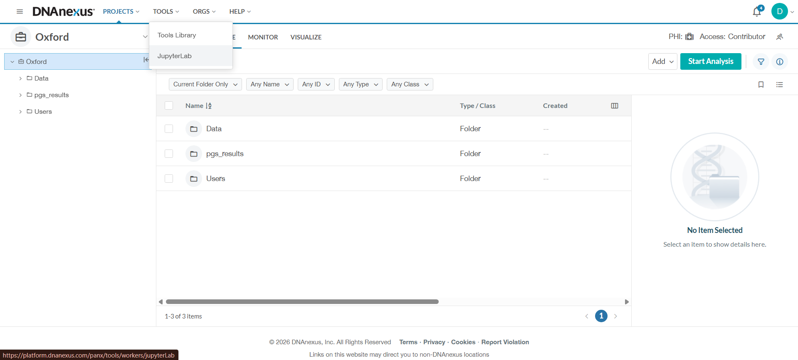
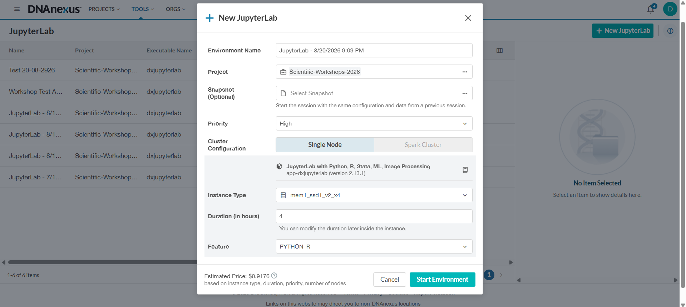
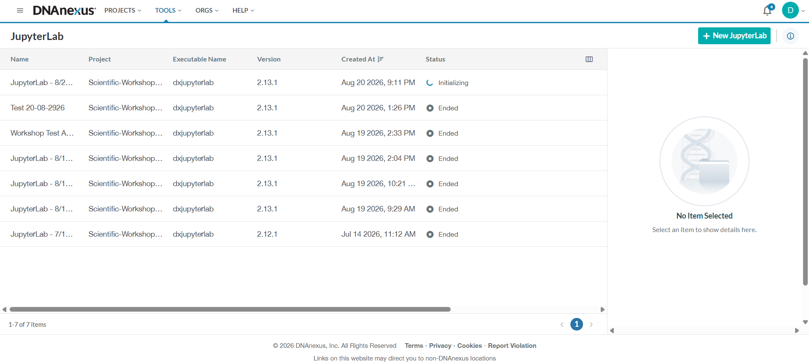
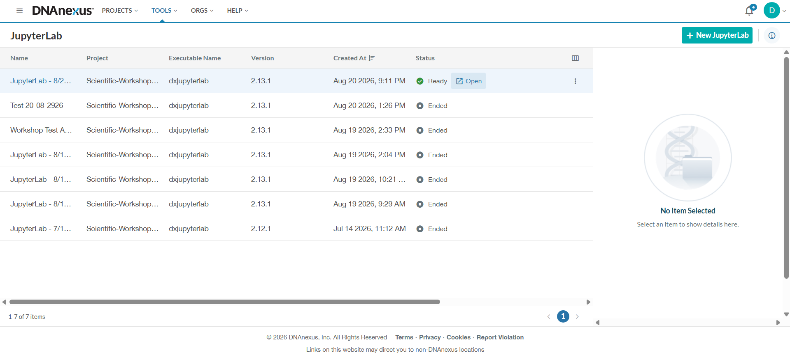

You are now ready to start your first JupyterLab environment.

The steps on this page are the same whether you are:

- attending an **MCPS workshop**; or
- working in an **MCPS research project**.

You should already have identified **your workspace** and the shared `mcps-dnanexus-onboarding/` folder.

## 1. Open JupyterLab

From the DNAnexus project interface, select:

**Tools → JupyterLab**

Then select **JupyterLab** from the menu.

{fig-alt="DNAnexus Tools menu with JupyterLab selected"}

::: {.callout-note title="Use this route"}
This tutorial uses the dedicated **Tools → JupyterLab** route.

DNAnexus also provides other ways to launch applications, but you do not need them for this tutorial.
:::

## 2. Start a new JupyterLab environment

The JupyterLab page lists previous environments and their status.

Select:

**+ New JupyterLab**

A configuration window will open.

## 3. Choose your project

Under **Project**, select the DNAnexus project you are currently working in.

This might be:

- your **MCPS workshop project**; or
- your **MCPS research project**.

The project you select here is the project that your JupyterLab environment will be able to access.

::: {.callout-note title="You are not moving your data"}
Starting JupyterLab does **not** download or move your project data to the temporary virtual computer.

The temporary JupyterLab environment is simply given access to the files already stored in your DNAnexus project.
:::

## 4. Choose the recommended settings

For this tutorial, use the following settings:

| Setting | What to select |
|---|---|
| **Environment Name** | Leave the automatically generated name |
| **Project** | The project you are working in |
| **Snapshot** | Leave blank |
| **Priority** | Leave at the default setting |
| **Cluster Configuration** | **Single Node** |
| **Instance Type** | **`mem1_ssd1_v2_x4`** |
| **Duration** | **1 hour** is sufficient for this tutorial |
| **Feature** | **`PYTHON_R`** |

{fig-alt="DNAnexus New JupyterLab window showing Single Node, mem1_ssd1_v2_x4, a one-session duration, and PYTHON_R"}

### Why these settings?

You do not need to understand all of the technical options available in DNAnexus.

For this tutorial:

- **Single Node** gives you one temporary computing environment.
- **`mem1_ssd1_v2_x4`** provides the computing resources we recommend for the introductory workflow.
- **`PYTHON_R`** provides the R environment used in the exercises.
- **Snapshot** is not needed for this tutorial.

For more demanding analyses, a different instance type may be appropriate. The recommended setting here is intended as a sensible starting point for MCPS training.

::: {.callout-tip title="You can change the duration later"}
DNAnexus allows you to modify the duration of a running environment later.

For this tutorial, **1 hour** is sufficient.
:::

## 5. Check the estimated price

Before starting the environment, look at the **Estimated Price** shown at the bottom of the window.

The price depends on the computing resources you select and the duration of the environment.

You do not need to calculate the cost yourself. Just get into the habit of checking the estimate before you start.

::: {.callout-caution title="Estimated price"}
The amount shown in your DNAnexus interface may be different from the amount shown in the screenshot.

Prices can change over time, and the estimate depends on your selected settings.
:::

## 6. Start the environment

Once the settings look correct, select:

**Start Environment**

DNAnexus will begin creating your temporary JupyterLab environment.

Your environment may initially show a status such as **In Queue** or **Initializing**.

{fig-alt="DNAnexus JupyterLab page showing a new environment with status Initializing"}

### Wait for the environment to become ready

You do not need to start another environment while this one is initializing.

Wait until the status changes to:

**Ready**

## 7. Open JupyterLab

When the environment is ready, the **Open** button will appear.

Select **Open**.

{fig-alt="DNAnexus JupyterLab page showing a Ready environment with an Open button"}

JupyterLab will open in your browser.

## 8. What happens next?

You now have a temporary computing environment running in the cloud.

Your DNAnexus project remains the place where your files are stored.

The next page will show you how to find your workspace in JupyterLab and open your supplied **`[DX]` notebook**.

::: {.callout-important title="Remember: project storage is persistent"}
Starting JupyterLab gives you temporary computing resources.

Your project files are still stored in DNAnexus and are not dependent on the JupyterLab environment remaining running.
:::

## Before moving on

Check that:

- your JupyterLab environment shows **Ready**;
- you can see the **Open** button; and
- you have opened JupyterLab successfully.

You are now ready to open your persistent notebook and start working in R.

[Next: 04 Open DX Notebook →](04-open-dx-notebook.qmd){.btn .btn-primary}