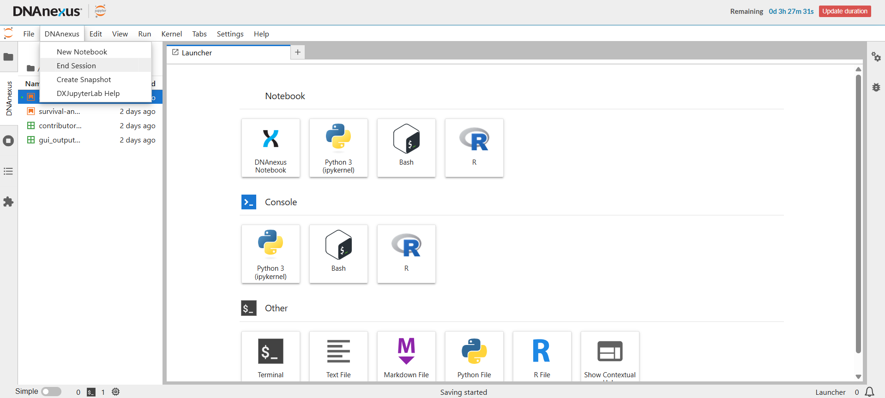

You have now completed the hands-on analysis and saved your **`[DX]` notebook**.

The next step is to end the temporary JupyterLab computing environment correctly.

## 1. Save your notebook one final time

Before ending the session, return to `getting-started.ipynb` and select **Save**.

Check that your notebook still contains:

- the R code you ran;
- the displayed data and summaries;
- the summary table; and
- the figure.

::: {.callout-important title="Save before ending the session"}
Ending JupyterLab stops the temporary computing environment and the current R session.

Make sure your `[DX]` notebook is saved before you continue.
:::

## 2. End the DNAnexus session

From the menu at the top of JupyterLab, select:

**DNAnexus → End Session**

{fig-alt="DNAnexus JupyterLab interface with the DNAnexus menu open and End Session selected"}

Follow any confirmation prompt that appears.

This deliberately ends the DNAnexus JupyterLab computing environment.

::: {.callout-warning title="Use DNAnexus → End Session"}
For this tutorial, use **DNAnexus → End Session** to end your computing session.

Do not rely on simply closing the browser tab. Closing the tab does not necessarily end the DNAnexus computing environment.
:::

## 3. What happens when you end the session?

Ending the session stops the temporary computer that has been running JupyterLab and R.

This means that:

- the current **R session ends**;
- objects held in R memory, such as `dat`, are no longer available;
- files kept only in the temporary JupyterLab environment should not be relied on as persistent storage; and
- the computing resources used by this JupyterLab session stop running.

However, files stored persistently in your DNAnexus project remain there.

This includes your saved **`[DX]` notebook**.

```text
Temporary JupyterLab environment
├── running R session       → ends
├── dat and other R objects → no longer in memory
└── temporary files         → do not rely on these as persistent storage

DNAnexus project
├── [DX] notebook           → remains
├── your workspace files    → remain
└── project data            → remain
```

::: {.callout-note title="Ending JupyterLab does not delete your project"}
You are stopping the **temporary computing environment**, not deleting the DNAnexus project.

Your persistent project files remain available for the next time you start JupyterLab.
:::

## 4. Why ending the session matters

A running JupyterLab environment uses computing resources.

Those resources have a cost while the environment is running.

When you have finished working, ending the session avoids leaving computing resources running unnecessarily.

Your environment will also end when its configured duration expires, but you should not normally wait for this if you have already finished your work.

::: {.callout-caution title="Closing your browser is not enough"}
If you close the JupyterLab browser tab or browser window, the computing environment may continue running until it is explicitly ended or reaches its configured time limit.

When you have finished your analysis, make a habit of using:

**DNAnexus → End Session**
:::

## 5. What about snapshots?

You may notice another option in the DNAnexus menu called **Create Snapshot**.

Snapshots can be useful in more advanced workflows for preserving aspects of a JupyterLab computing environment for a later session.

You do **not** need to create a snapshot for this tutorial.

Your important work is already being preserved through the DNAnexus project and your `[DX]` notebook.

## Checkpoint

Before continuing, confirm that:

- you saved `getting-started.ipynb`;
- you selected **DNAnexus → End Session**; and
- the JupyterLab session has ended.

::: {.callout-success title="Session ended"}
You have now safely stopped the temporary computing environment.

On the next page, you will start a **new JupyterLab session** and confirm that your saved `[DX]` notebook is still there.
:::

[Next: 08 Return and continue →](08-return-and-continue.qmd){.btn .btn-primary}